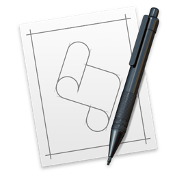

#  BatteryAlarm.app 

[README 日本語版 :sushi:](README_ja.md "README_ja.md")

- ## Table of Contents :scroll:
  - <a href="#1"> Features :dart:
  - <a href="#2"> Demo :clapper:
  - <a href="#3"> Development Environment :wrench:
  - <a href="#4"> Installation :inbox_tray:
  - <a href="#5"> Usage :fist:
  - <a href="#6"> Author </a>

- ## <a name="1"> Features :dart:</a>
  - BatteryAlarm.app is an application that notifies you according to the charging degree of your MacBook (Air, Pro) battery.
  - In order to prolong the lithium-ion battery adopted by MacBook (Air, Pro), it is necessary to operate with the charge rate kept to 80% or less.
  - This application will notify you when the Battery Status reaches **79% ↑ && Charging** or **40% ↓ && Discharging**

- ## <a name="2"> Demo :clapper:</a>
  <table>
       <thead>
           <tr>
               <th>Battery Status</th><th>Notification</th>
           </tr>
       </thead>
       <tbody>
           <tr>
               <td>79%↑ && Charging</td><td></td>
           </tr>
           <tr>
               <td>40%↓ && Discharging</td><td></td>
           </tr>
       </tbody>
   </table>

- ## <a name="3"> Development Environment :wrench:</a>
  - macOS Sierra 
  - AppleScript 2.5 

- ## <a name="4"> Installation :inbox_tray:</a>
  - Download the repository by pressing the "Download ZIP" button.
  - Drag and drop the BatteryAlarm.app to your applications folder.

- ## <a name="5"> Usage :fist:</a>
  - Double click BatteryAlarm.app.
  - You can rewrite main.scpt as you like.
    - BatteryAlarm.app/Contents/Resources/Scripts/main.scpt

- ## <a name="6"> Author </a>
  - <a href="http://blog.logfractal.com" target="_blank">http://blog.logfractal.com</a>
