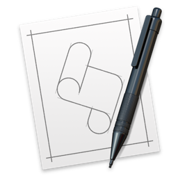

#  BatteryAlarm.app 

[README English version :pizza:](README.md "README.md")

- ## Table of Contents :scroll:
  - <a href="#1"> Features :dart:
  - <a href="#2"> Demo :clapper:
  - <a href="#3"> Development Environment :wrench:
  - <a href="#4"> Installation :inbox_tray:
  - <a href="#5"> Usage :fist:
  - <a href="#6"> Author </a>

- ## <a name="1"> Features :dart:</a>
  - BatteryAlarm.appは、MacBook（Air、Pro）バッテリーの充電量に応じて通知するアプリケーションです。
  - MacBook（Air、Pro）で採用されているリチウムイオン電池の寿命を長引かせるには、充電率を80％以下に抑えて作業する必要があります。
  - このアプリケーションは、バッテリーが **79%以上 && 充電中** または **40%↓ && 放電中** になると通知します。

- ## <a name="2"> Demo :clapper:</a>
    <table>
         <thead>
             <tr>
                 <th>バッテリー</th><th>通知</th>
             </tr>
         </thead>
         <tbody>
             <tr>
                 <td>79%↑ && 充電中</td><td></td>
             </tr>
             <tr>
                 <td>40%↓ && 放電中</td><td></td>
             </tr>
         </tbody>
     </table>

- ## <a name="2"> Development Environment :wrench:</a>
  - macOS Sierra 
  - AppleScript 2.5 

- ## <a name="3"> Installation :inbox_tray:</a>
  - Download ZIP"ボタンを押してリポジトリをダウンロードしてください。
  - BatteryAlarm.appをアプリケーションフォルダにドラッグアンドドロップしてください。

- ## <a name="4"> Usage :fist:</a>
  - BatteryAlarm.appをダブルクリックしてください。
  - main.scptを好きなように書き直せます。
    - BatteryAlarm.app/Contents/Resources/Scripts/main.scpt

- ## <a name="5"> Author </a>
  - <a href="http://blog.logfractal.com" target="_blank">http://blog.logfractal.com</a>
